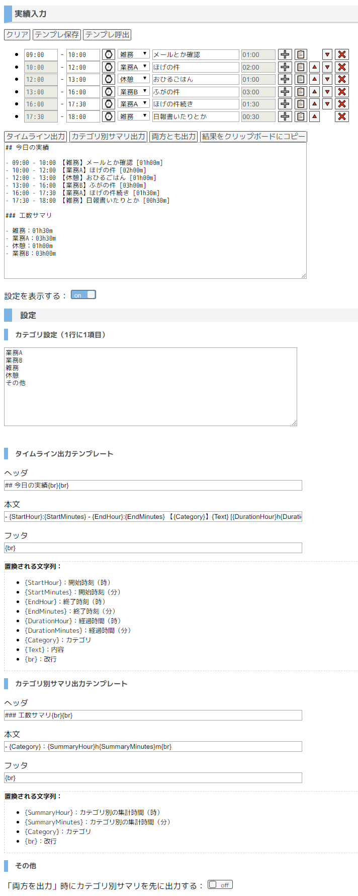

# Daily Results Record Helper

Browser-based schedule and daily-activity logging tool.

日々の予定や行動記録・実績などを書くためのツール。
会社の日報を書く際に使うために書いた。
（あとは `vue.js` を使ってみたかった）

## 使い方

1. 開始時間と終了時間を入力する（2行目のアイテムからは1行上のアイテムの終了時間が開始時間に設定される）
2. カテゴリを選択する（カテゴリは設定で編集可能）
3. 内容を入力する
4. 「➕」ボタンを押して次の項目を挿入する
5. 1 - 4 を繰り返し、入力が完了したら下の出力ボタンを押す
6. 「クリップボードにコピー」ボタンを押してクリップボードにコピーする

## スクリーンショット

